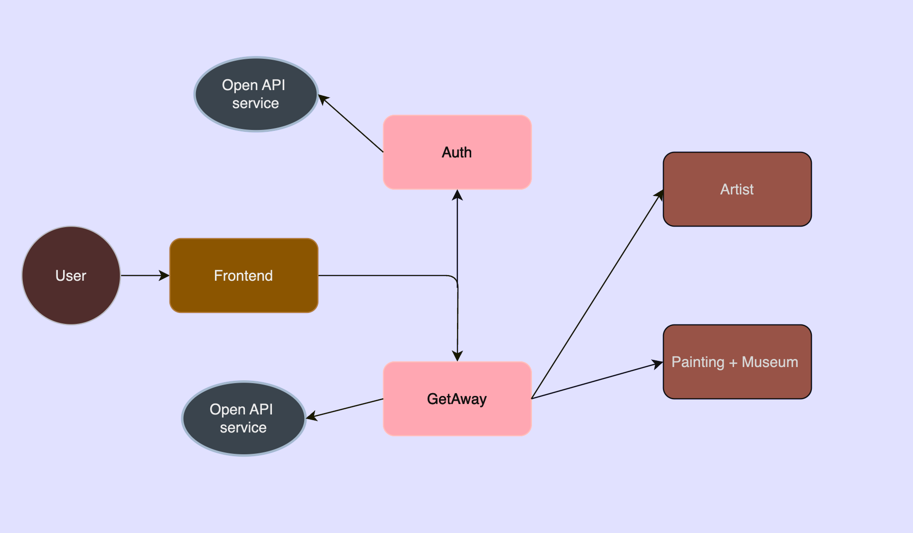

# Rococo Back-end

Описание проекта

Проект представляет собой Spring-микросервисное приложение. Общение с фронтом происходит по Rest, внутри сервисы
общаются по GRPC. В качестве БД используется MySQL. Для внешнего использования подключено Open API (openapi 3.0.1).
Архитектурная схема ниже:



# Запуск Rococo Back-end

Гайд по запуску бэка:

Запуск Rococo-backend реализовн локально (без докера)

- Создание БД:

```posh
Dmitriis-MacBook-Pro rococo % cd rococo-client
Dmitriis-MacBook-Pro rococo-client % npm i
Dmitriis-MacBook-Pro rococo-client % npm run dev
```

- Создание cхем и пользователей:

```posh
User-MacBook ~ % mysql -u root -p  
mysql> CREATE SCHEMA auth;
mysql> CREATE SCHEMA rococo;
mysql> CREATE USER 'admin'@'localhost' IDENTIFIED BY 'admin';
mysql> GRANT ALL PRIVILEGES ON auth.* TO 'admin'@'localhost';
mysql> GRANT ALL PRIVILEGES ON rococo.* TO 'admin'@'localhost';
```

- Запускается Rococo-backend сервисы стандартно либо через main сервиса, либо через Services (в Idea)

```posh
Active profile = local
```

# Rococo Test

- Все e2e (API + UI) тесты находя в модуле e2e-tests
- Запускаются локально как и Rococo Back-end
- Тестовый проект использует кодогенератор https://openapi-generator.tech/docs/generators/java для геренации Rest DTO (+
  ENUMS) и клиента (Retrofit)

# Запуск тестов

#### 1. Генерация кода (DTO + client):

Спека open api используется для getaway и cервиса, в проекте лежит готовая к генерации спека
(e2e-tests/specs/getaway_spec.yaml), поэтому готовить ничего не надо (ниже будет указан опциональный шаг для подготовки
схемы при измении API)

- Запуск таски (При скачивании проекта весь сгенерированный код будет красным в e2e-tests, ВАЖНО не удалять импорты,
  иначе магия не случится

```posh
 e2e-tests % gradle clean buildGetawayClient
```

#### 2. Запуск тестов:

Запуск тестов происходит таской

```posh
 НАПИСАТЬ ТУТ ТАСКУ ПО ЗАПУСКУ ТЕСТОВ //todo написать тут таску
```

#### 2. Просмотр отчета

```posh
//todo написать тут таску для отчета
```

#### Создание OpenApi спеки

```posh
//todo написать тут таску для отчета
```
