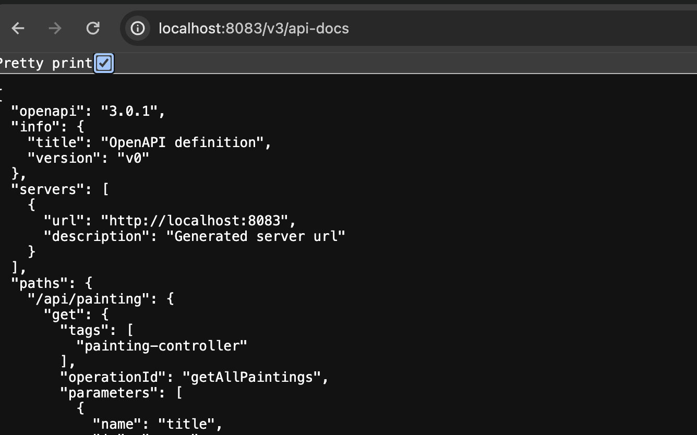

# Rococo Back-end

Описание проекта

Проект представляет собой Spring-микросервисное приложение. Общение с фронтом происходит по Rest, внутри сервисы
общаются по GRPC. В качестве БД используется MySQL. Для внешнего использования подключено Open API (openapi 3.0.1).
Архитектурная схема ниже:


# Запуск фронтенда

Ссылка на фронтенд - https://github.com/Newmmen/rococo_frontend

Запуск фронтенда:

```posh
User-MacBook-Pro rococo % cd rococo-client
User-MacBook-Pro rococo-client % npm i
User-MacBook-Pro rococo-client % npm run dev
```

# Запуск Rococo Back-end

Гайд по запуску бэка:
Версии: 

```posh
java - 17.0.9
gradle - 8.4
```

Запуск Rococo-backend реализовн локально (без докера)

- Создание БД и пользователей для MacOc:

```posh
User-MacBook ~ % brew install mysql
User-MacBook ~ % brew services start mysql
User-MacBook ~ % mysql -u root -p  
mysql> CREATE SCHEMA auth;
mysql> CREATE SCHEMA rococo;
mysql> CREATE USER 'admin'@'localhost' IDENTIFIED BY 'admin';
mysql> GRANT ALL PRIVILEGES ON auth.* TO 'admin'@'localhost';
mysql> GRANT ALL PRIVILEGES ON rococo.* TO 'admin'@'localhost';
```

- Запускается Rococo-backend сервисы стандартно либо через main сервиса, либо через Services (в Idea)

Запускать сервисы:
```posh
RococoArtistsApplication
RococoAuthApplication
RococoGetawayApplication
RococoPaintingApplication
```

```posh
Active profile = local
```

# Rococo Test

- Все e2e (API + UI) тесты находя в модуле e2e-tests
- Запускаются локально как и Rococo Back-end
- Тестовый проект использует кодогенератор https://openapi-generator.tech/docs/generators/java для геренации Rest DTO (+
  ENUMS) и клиента (Retrofit)

### Особенности тестового проекта

#### 1. Генерация кода (DTO + client):

Спека open api используется для getaway и cервиса, в проекте лежит готовая к генерации спека
(`e2e-tests/specs/getaway_spec.yaml`), поэтому готовить ничего не надо (ниже будет указан опциональный шаг для
подготовки схемы при измении API)

#### Классы и методы (DTO):

Генерируются DTO, например вот так выглядят поля класса ArtistDto

```java
public class ArtistDto {
    public static final String SERIALIZED_NAME_ID = "id";
    @SerializedName(SERIALIZED_NAME_ID)
    private UUID id;

    public static final String SERIALIZED_NAME_NAME = "name";
    @SerializedName(SERIALIZED_NAME_NAME)
    private String name;

    public static final String SERIALIZED_NAME_BIOGRAPHY = "biography";
    @SerializedName(SERIALIZED_NAME_BIOGRAPHY)
    private String biography;

    public static final String SERIALIZED_NAME_PHOTO = "photo";
    @SerializedName(SERIALIZED_NAME_PHOTO)
    private String photo;
```

Также в классе переопределяются equals() и hashcode() в соответствии с контрактом и полями класса

```java
@Override
public boolean equals(Object o){
        if(this==o){
        return true;
        }
        if(o==null||getClass()!=o.getClass()){
        return false;
        }
        ArtistDto artistDto=(ArtistDto)o;
        return Objects.equals(this.id,artistDto.id)&&
        Objects.equals(this.name,artistDto.name)&&
        Objects.equals(this.biography,artistDto.biography)&&
        Objects.equals(this.photo,artistDto.photo);
        }

@Override
public int hashCode(){
        return Objects.hash(id,name,biography,photo);
        }
```

Для отображения объектов переопределен toString(). Выводятся все поля в консоль

```java
    @Override
public String toString(){
        StringBuilder sb=new StringBuilder();
        sb.append("class ArtistDto {\n");
        sb.append("    id: ").append(toIndentedString(id)).append("\n");
        sb.append("    name: ").append(toIndentedString(name)).append("\n");
        sb.append("    biography: ").append(toIndentedString(biography)).append("\n");
        sb.append("    photo: ").append(toIndentedString(photo)).append("\n");
        sb.append("}");
        return sb.toString();
        }
```

Также переопределены конструкторы, геттеры и сеттеры. По необходимости можно навесить любые аннотации на генерируемый
класс (например билдер)

```java
/**
 * ArtistDto
 */
@lombok.Builder(toBuilder = true)
@lombok.RequiredArgsConstructor
@lombok.AllArgsConstructor

public class ArtistDto {
```

#### Клиенты (retrofit):

Также происходит генерация всех классов необходимого для общения с бэком. В данном случе был выбран retrofit2.
Происходит генерация всех необходимых интерфейсов Пример сгенерированного client:

```java
public interface ArtistControllerApi {
    /**
     * @param newArtistDto  (required)
     * @return Call&lt;ArtistDto&gt;
     */
    @Headers({
            "Content-Type:application/json"
    })
    @POST("api/artist")
    Call<ArtistDto> createArtist(
            @retrofit2.http.Body NewArtistDto newArtistDto
    );
```

Для имплементации данного интерфейса также генеруются необходимые инструменты. **ApiClient** - OkHttp клиент,
**HttpBearerAuth** - интерсептор для внедрения bearer токена (BearerStorage самописное тредлокал хранилище для токена).
В результате апи степ для создания автора может выглядеть так:

```java
@Step("create artist")
public ArtistDto createArtist(NewArtistDto artistDto)throws IOException{
        ApiClient apiClient=new ApiClient()
        .addAuthorization("auth",new HttpBearerAuth("bearer"))
        .setBearerToken(BearerStorage.getCurrentBearer());
        ArtistControllerApi api=apiClient.createService(ArtistControllerApi.class);
        return api.createArtist(artistDto).execute().body();
        }
```

#### Кастомная таска для генерации данных:

Таска находится в `build.gradle` внутри модуля `e2e-tests`. Из важно стоит отметить выбор
генератора `generatorName. set("java")` доступно большое кол-во генераторов под разные языки. `library : "retrofit2"` -
также доступно большое кол-во фреймворков для реализации http клиента от самых популярный (например, rest-assured,
retrofit) до редкоиспользуемых тестировщиками (например, feign client)

```groovy 
task buildGetawayClient(type: GenerateTask) {
    generatorName.set("java")
    inputSpec.set("$projectDir/specs/getaway_spec.yaml")
    outputDir.set("$projectDir/build/generated")
    configOptions.set([
            library             : "retrofit2",
            interfaceOnly       : "false",
            serializationLibrary: "gson",
            sourceFolder        : "",
            useJakartaEe        : "true",
            dateLibrary         : "java8-localdatetime"
    ])
}
```

Также можно задавать место генерации в проекте - в данном случае это `$projectDir/build/generated`, стоит не забыть
добавить в мейн директорию, в которуй будет лежать наш сгенерированный код. Например, можно сделать вот так:

`sourceSets.main.java.srcDirs = ["$projectDir/build/generated/org/openapitools/client/", "$projectDir/src/main/java"]`

Запуск таски (При скачивании проекта весь сгенерированный код будет красным в e2e-tests, ВАЖНО не удалять импорты, иначе
магия не случится

```posh
 e2e-tests % gradle clean buildGetawayClient
```

#### 2. Авторизация:

Реализовано 2 способова авторизации для API тестов и для UI тестов

- API авторизация для тестирования микросервисов (API tests)

Для этого используется `@ApiForClientExtension` в данном классе из числа заготовленных учеток потоки разбирают креды и
логинятся при помощи авторизации OAUTH 2.0.

Реализация хранения учеток `CredsDto` в ConcurrentLinkedQueue, а затем уже в ConcurrentHashMap для удобного доступа к
юзерам с различным типом (пока реазиован только `UserType.DEFAULT`)

```java
 private static final Map<UserType, Queue<CredsDto>>USERS=new ConcurrentHashMap<>();
static {
        Queue<CredsDto> defaultUsers=new ConcurrentLinkedQueue<>();
        defaultUsers.add(new CredsDto("****","****"));
        defaultUsers.add(new CredsDto("****",""****""));
        USERS.put(UserType.DEFAULT,defaultUsers);
        }
```

Далее реализован механизм вытаскивания `CredsDto` из очереди и использования в тесте и складывания в очередь после
проведения теста, если тесту не хватило учеток, то он будет ожидать пока другие тесты не вернут свои `CredsDto`
обратно в очередь. Реализация данного механизма представлена ниже

```java
  Queue<CredsDto> queue=USERS.get(apiLogin.userType());
  while(testCandidate==null&&safeCounter< 300){
        testCandidate=queue.poll();
        if(testCandidate==null){
            try{
                Thread.sleep(100);
            }catch (InterruptedException e){
                throw new NoDataForTest("Cant find unused user for AT");
            }
            safeCounter++;
        }
      }
      if(testCandidate==null){
        throw new NoDataForTest("Cant find unused user for AT");
        }
```

- API авторизация для UI тестов

Для авторизации в браузере также используется API через OAUTH 2.0, но юезры создаются в БД перед тестом и удаляются 
после его завершения. Это реализовано в `CreateUserExtension` 
```java
      UserEntity userAuth = new UserEntity();
      userAuth.setUsername(username);
      userAuth.setPassword(password);
      userAuth.setEnabled(true);
      Map<String, Object> createdUser = Map.of(
          "auth", userAuth
      );
      userRepository.createInAuth(userAuth);
      extensionContext.getStore(DB_CREATE_USER_NAMESPACE).put(extensionContext.getUniqueId(), createdUser);
```
Для логина используется `@ApiLoginExtension`. Полученные в результате API авторизации куки и токены подкладываются в 
local-storage браузера, где уже используются для UI тестов
        
```java
        LocalStorage localStorage = Selenide.localStorage();
        localStorage.setItem("codeChallenge", getCodChallenge(extensionContext));
        localStorage.setItem("id_token", getToken(extensionContext));
        localStorage.setItem("codeVerifier", getCodeVerifier(extensionContext));
        WebDriverRunner.getWebDriver().manage().addCookie(jsessionCookie());
        Selenide.refresh();
```


#### 3. Запуск тестов:

Тесты поделены на UI и API, запускаются общей таской

```posh
e2e-tests % gradle test
```

#### Создание OpenApi спеки
Несмотря на то, что спека готова к генерации потребуется создавать ее заново. При расширении проекта (создания 
нового сервиса или АТ проекта) или при изменении контракта API, в любом случае ниже будет описано как это реализоано 
в Rococo.

Схема OpenApi для сервисов AUTH и GETAWAY


Для генерации спеки нужно сделать след шаги:

1) Убедиться, что `spring-doc` добавлен в зависимости модуля

```groovy
   implementation 'org.springdoc:springdoc-openapi-starter-webmvc-api:2.3.0'
```
2) Проверить исключение для `Security Config`

```java
 customizer.requestMatchers(
        antMatcher(HttpMethod.GET, "/v3/**"))
        .permitAll()
        .anyRequest()
        .authenticated()
```
3) Запустить локально сервис и перейти по адресу `http://localhost:service_host/v3/api-docs`

Откроется API с готовой спекой для выбранного сервиса


4) Скачать спеку можно в json и yaml, для этого пройти по соотв ссылке

```posh
   http://localhost:service_host/v3/api-docs.yaml
   http://localhost:service_host/v3/api-docs.json
```

5) В скачанной спеке необходимо поменять тип данных Pagable на String и переименовать название файла на название 
   сервиса (В данном случае getaway_spec.yaml)
```yaml
        pageable:
          type: string
```
7) Готовую спеку подложить в `$projectDir/specs`

